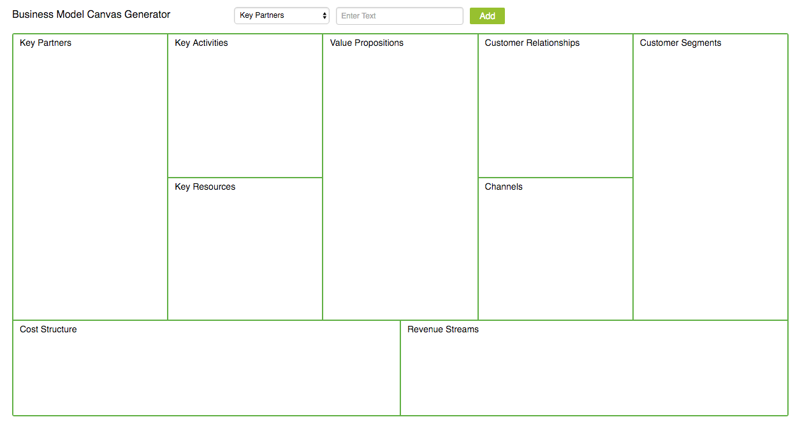

# Business Model Canvas Generator

This is a web application built to generate business model canvases. Based off of [React-Slingshot](https://github.com/coryhouse/react-slingshot), this app is built with React and Redux

From Wikipedia:
> The Business Model Canvas is a strategic management and lean startup template for developing new or documenting existing business models.It is a visual chart with elements describing a firm's or product's value proposition, infrastructure, customers, and finances.It assists firms in aligning their activities by illustrating potential trade-offs.

Learn more about the [Business Model Canvas](http://www.businessmodelgeneration.com/canvas/bmc).

I will host the app once I have ironed out some bugs and added some features to make it a little more functional. 

V0.0.1 - BUGS BE HERE

Features I'm Working On:
+ Color Coding Items
+ Deletion of Items
+ Saving of BMC's
+ Exporting to PDF
    
